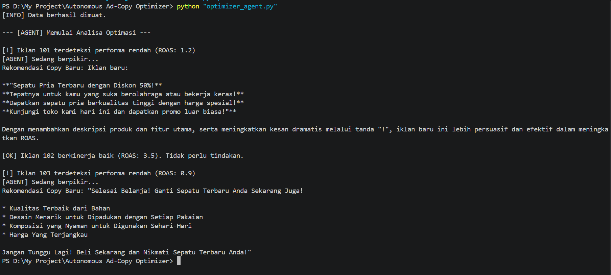

Autonomous Ad-Performance Optimizer
Sistem AI Agent yang memantau performa iklan secara otonom, menganalisis data real-time, dan memberikan optimasi konten berbasis model bahasa lokal (Llama 3.1). Proyek ini dirancang untuk otomasi e-commerce yang mengutamakan privasi data dan efisiensi operasional.

🚀 Fitur Utama
1. Autonomous Decision Engine: Logika berbasis threshold untuk mendeteksi performa iklan secara instan.
2. Local AI Integration: Menggunakan Ollama (Llama 3.1) untuk pembuatan ad-copy kreatif tanpa biaya API.
3. Audit Trail: Sistem otomatis menyimpan log keputusan ke logs/ untuk keperluan evaluasi.
4. Modular Architecture: Struktur proyek yang rapi dan siap untuk skalabilitas tinggi.

⚙️ How it Works
Sistem ini menjalankan loop optimasi sebagai berikut:
1. Data Ingestion: Agent membaca performa iklan dari data/ad_data.csv.
2. Analysis: Jika ROAS di bawah target (2.0), sistem akan memicu Brain (AI Agent).
3. Execution: Llama 3.1 secara otomatis menyusun variasi copy iklan baru yang lebih persuasif.
4. Audit Trail: Hasil keputusan dan copy baru disimpan di logs/laporan_optimasi.json.

🛠️ Cara Menjalankan
Pastikan Ollama terinstall dan model llama3.1 tersedia.

1. Install dependensi:
 pip install -r requirements.txt
2. Jalankan Agent:
 python agents/optimizer_agent.py

🚀 Future Improvements
1. API Integration: Menghubungkan langsung ke Meta, Google, dan TikTok Marketing API.
2. Database Migration: Migrasi ke PostgreSQL/Supabase untuk data logging yang lebih kompleks.
3. Observability: Integrasi dengan Langfuse untuk tracking kualitas keputusan AI (evals).
4. Cloud Deployment: Otomatisasi cron job di cloud agar berjalan 24/7.

📊 Result Preview
Berikut adalah bukti visual bahwa sistem **Autonomous Ad-Performance Optimizer** berhasil mendeteksi performa rendah dan memberikan rekomendasi *copy* baru menggunakan model Llama 3.1 secara lokal:

